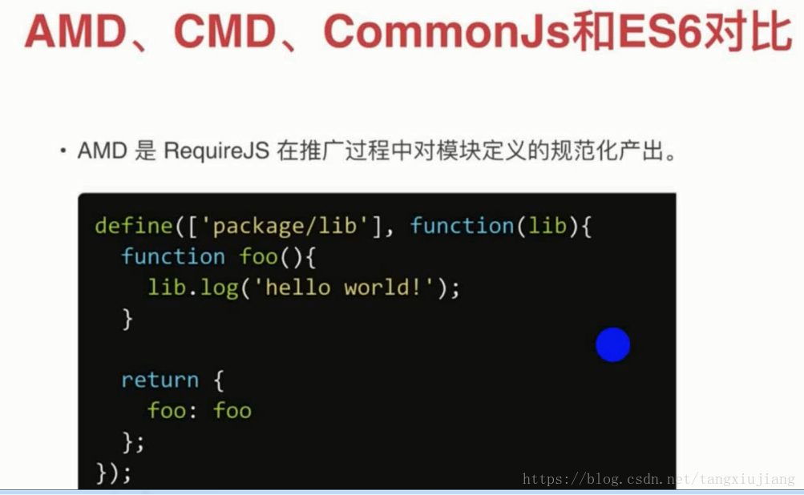
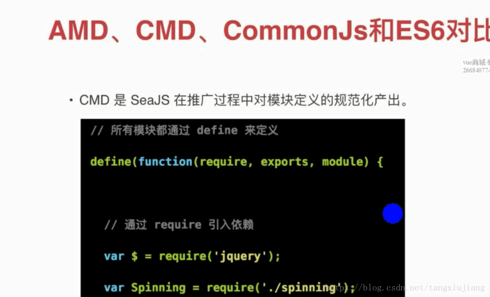
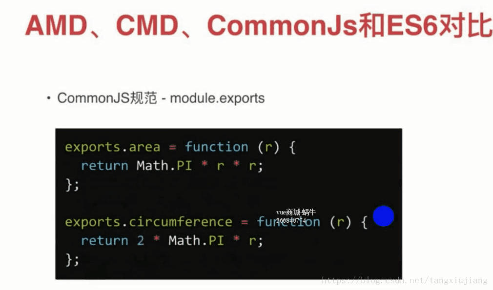
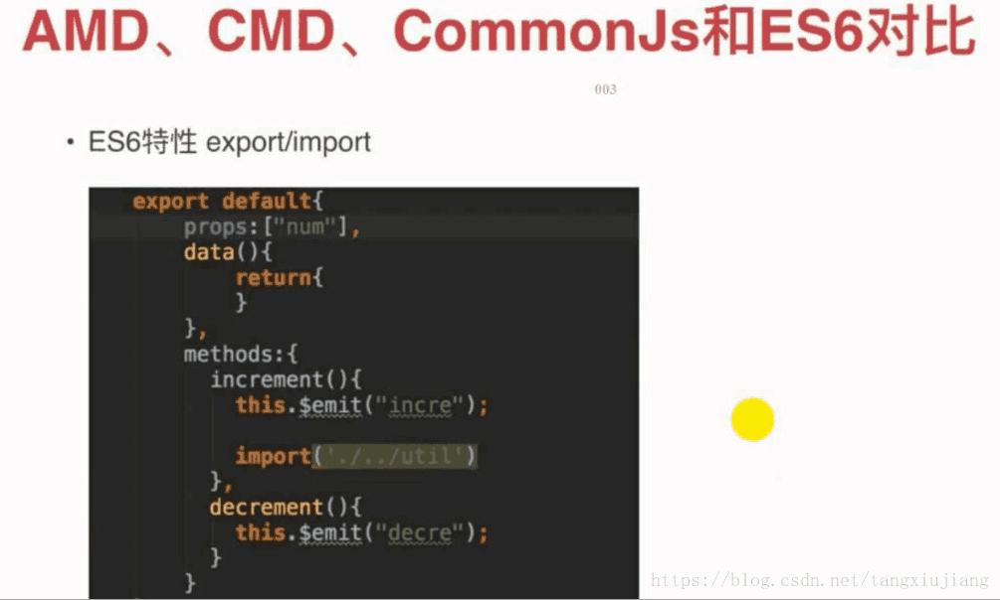

# AMD、CMD、Commonjs、EcmaScript
***
[TOC]
***
**处理模块化**
+ nodejs通过require引入模块，且模块相互依赖嵌套，只引入模块的入口文件，入口文件require模块，模块再require其他模块，形成链式树形引用，不考虑模块加载的顺序，且模块自身变量不能影响树形结构中其他模块，仅在当前模块内有效，通过向module.exports添加属性完成向其他模块传参，称之为`Commonjs`
+ 原生js模块化，需要通过script标签引入模块文件，且模块相互依赖，考虑库依赖顺序，且模块间全局变量受影响
+ `require.js`和`sea.js`解决浏览器中像nodejs中模块化，分别`AMD`和`CMD`
+ `EcmaScript`官方规范模块化
***
### AMD

***
###  CMD

***
### CommonJs

***
### ES6

***
以上规范引用模块方式