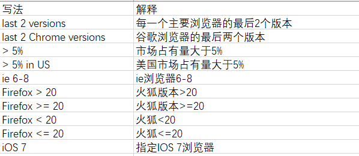

# Sublime Text3常用插件
***
[TOC]
***
## 关闭输入法自带的快捷键
***
## 插件安装及其卸载
#### 安装插件
菜单栏Perferences-Package Control弹出输入框，输入Install Package，弹出输入框输入插件名，点击即可自动安装等待
#### 卸载插件
菜单栏Perferences-Package Control弹出输入框，输入
Remove Package，弹出已经安装的插件列表，选择删除，等待结束
***
## Emmet
**前端html和css自动补齐插件**
自动安装PyV8
`修改tab快捷键`
菜单栏Perferences > Package Settings > Emmet > Key Bindings-User打开
```json
[
  {
    "keys": [
      "tab"
    ],
    "args": {
      "action": "expand_abbreviation"
    },
    "command": "run_emmet_action",
    "context": [
      {
        "key": "emmet_action_enabled.expand_abbreviation"
      }
    ]
  }
]
```
重启
tab键自动补齐css和html代码
详细使用方法见后文
***
## JavaScript Completions
**js代码提示工具**
***
## JQuery
**jquery代码提示工具**
***
## Pretty JSON
**json格式化工具**
`注意格式化必须是纯json的js文件，不能含js代码`
`快捷键ctrl+alt+j`
***
## AutoFileName
**自动读取文件目录**
***
## jsFormat
**自动格式化js代码**
`快捷键ctrl+alt+f`
***
## js、css代码自动校验插件
**安装方法**
1. 在Sublime Text3安装以下多个插件
    `SublimeLinter`
    `SublimeLinter-jshint`
    `SublimeLinter-csslint`

2. nodejs全局安装模块
    `npm install -g jshint`
    `npm install -g csslint`

3. 修改配置
    Perferences > Package Settings > SublimeLinter > Settings
    在右边栏添加
  ```json
  {
  "debug": true
  }
  ```
  并保存

  `高版本node失效如10.0.0`
***

## html-css-js Prettify
**格式化html、css、js全能性**
`修改node路径`
Peferences > Package Settings > HTML/CSS/JS Prettify > Set node Path
将

```json
"windows": "C:/Program Files/nodejs/node.exe"
```
改为
```json
"windows": "C:/developer/nodejs/node.exe"
```
**快捷键ctrl+shift+h**
`该美化较慢`
***
## SideBarEnhancements
**侧边栏增强插件，一键以相应的浏览器打开文件**
Perferences > Package Settings > Side Bar > Key Bindings-Users
添加语句如下
```json
  { 
    "keys": ["f1"],
    "command": "side_bar_open_in_browser",
    "args":{
      "paths":[], 
      "type":"production", 
      "browser":"chrome"
    }
  },
  { 
    "keys": ["f2"],
    "command": "side_bar_open_in_browser",
    "args":{
      "paths":[], 
      "type":"production", 
      "browser":"firefox"
    }
  },
  { 
    "keys": ["f3"],
    "command": "side_bar_open_in_browser",
    "args":{
      "paths":[], 
      "type":"production", 
      "browser":"opera"
    }
  },
```
`其中opera有点默认安装路径不是C:\Program Files\Opera`
`更改安装路径或者修改快捷键如下，建议更改安装路径`
```json
  { 
    "keys": ["f4"],
    "command": "side_bar_files_open_with" ,
    "args":{
      "paths":[], 
      "application":"C:/Users/Administrator/AppData/Local/Programs/Opera/launcher.exe", 
      "extensions":".*"
    }
  },
```
`当找不到用默认浏览器打开`
***
## Autoprefixer
**自动补齐css前缀**
`需要Sublime Text3的node环境配置`
Preferences > Key Bindings
添加
```json
{ 
  "keys": ["ctrl+alt+p"], "command": "autoprefixer" 
},
```
`修改插件默认配置`
```json
{
	"prefixOnSave": false,
	"browsers": ["defaults"],
	"cascade": true,
	"remove": true,
	"supports": true,
	"flexbox": true,
	"grid": true
}
```
改为
```json
{
	"prefixOnSave": ture,
	"browsers": ["last 2 version", "> 0.1%", "> 5% in US", "ie 6-8","Firefox < 20"],
	"cascade": true,
	"remove": true,
	"supports": true,
	"flexbox": true,
	"grid": true
}
```
以上保存自动添加css前缀
默认的是没有兼容IE/opera的-ms/-o
browser参数修改

`html页面内需选中css部分再手动使用快捷键添加，否则报错，css文件则保存时自动添加`
`其中自动保存添加css前缀，随着版本提高，逐渐各大浏览器开始取消自家保留的前缀`
***
## ColorPick
**颜色代码以该颜色高亮显示**
`需要安装NET Framework 4.5`
Perferences > Key Bindings添加如下快捷键

```json
{
    "keys": ["ctrl+alt+c"],
    "command": "color_pick"
},
```
***
## BracketHighLighter
**成对括号高亮显示**
Perferences > Package Settings > BracketHighLighter > Bracket Settings
左边默认不能修改，复制左边需要修改文本到右侧
```json
"bracket_styles": {
        // "default" and "unmatched" styles are special
        // styles. If they are not defined here,
        // they will be generated internally with
        // internal defaults.

        // "default" style defines attributes that
        // will be used for any style that does not
        // explicitly define that attribute.  So if
        // a style does not define a color, it will
        // use the color from the "default" style.
        "default": {
            "icon": "dot",
            // Support the old convention of "brackethighlighter.default"
            // for themes that already provide something.
            // As this has always been the only one we've provided
            // by default, all the others will use region-ish colors.
            "color": "region.yellowish brackethighlighter.default",
            "style": "highlight"
        },

        // This particular style is used to highlight
        // unmatched bracket pairs.  It is a special
        // style.
        "unmatched": {
            "icon": "question",
            "color": "region.redish",
            "style": "outline"
        },
        // User defined region styles
        "curly": {
            "icon": "curly_bracket",
            "color": "region.purplish"
            // "style": "underline"
        },
        "round": {
            "icon": "round_bracket",
            "color": "region.yellowish"
            // "style": "underline"
        },
        "square": {
            "icon": "square_bracket",
            "color": "region.bluish"
            // "style": "underline"
        },
        "angle": {
            "icon": "angle_bracket",
            "color": "region.orangish"
            // "style": "underline"
        },
        "tag": {
            "icon": "tag",
            "color": "region.orangish"
            // "style": "underline"
        },
        "c_define": {
            "icon": "hash",
            "color": "region.yellowish"
            // "style": "underline"
        },
        "single_quote": {
            "icon": "single_quote",
            "color": "region.greenish"
            // "style": "underline"
        },
        "double_quote": {
            "icon": "double_quote",
            "color": "region.greenish"
            // "style": "underline"
        },
        "regex": {
            "icon": "star",
            "color": "region.greenish"
            // "style": "underline"
        }
    }
```
改成
```json
"default": {
            "style": "highlight"
        },
```
括号成对高亮显示

***
## Node Completions
nodejs语法提示插件
***
## Bootstrap 3 Snippets
boostrap3代码段

Perferences > Settings右边Preference.sublime-settings-User添加

```js
"auto_complete_triggers": [{"selector": "text.html", "characters": "bs3"}]
```

## Bootstrap 3 Autocomplete
bootstrap类名提示工具
